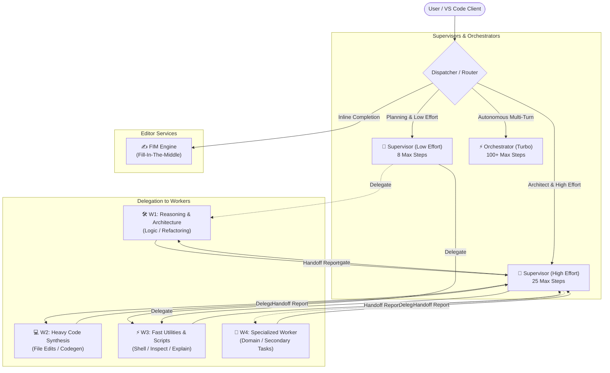

# SerenityDev Local Agent Interface

Local multi-agent orchestration backend and VS Code extension for running private, self-hosted LLM coding agents over local GGUFs via `llama-server` and `llama.cpp`.

## Purpose

- **100% Local & Private**: Zero telemetry, offline execution on consumer GPUs/CPUs.
- **Hierarchical Multi-Agent Routing**: Specialized Supervisor, Orchestrator, and Worker model roles.
- **Dynamic VRAM Lifecycle**: Per-role model hot-swapping, KV cache quantization, layer offloading, and auto-unloading.
- **Agent Memory & Tools**: Native Model Context Protocol (MCP) server, file/shell tools, and persistent long-term memory.

---

## Quick Setup Guide

### 1. Prerequisites
- **OS**: Windows 10/11 (64-bit), Linux, or macOS.
- **Python**: Python 3.10 – 3.14 (64-bit).
- **Inference Backend**: `llama-server` binary in system `PATH` (recommended) or `llama-cpp-python` with CUDA/Metal/CPU support.
- **Hardware**: 4-core CPU, 8GB RAM minimum; NVIDIA GPU with CUDA 12.x+ (6GB+ VRAM) recommended for GPU layer offloading and multi-tier routing.
- **Build Tools (Optional)**: Microsoft Visual C++ Build Tools (MSVC 2019/2022) or GCC/Clang if building native backends from source.
- **Node.js (Development)**: Node.js 18+ and npm (for compiling VS Code extension).
- **Local Models**: At least one local GGUF model file.

### 2. Install Dependencies
```bash
pip install -r requirements.txt
```

### 3. Configure Model Storage
Store GGUF files in a `./models` directory inside workspace root, or configure a custom path:
- Open VS Code Settings (`Ctrl+,`) -> Search `serenitydev.modelsPath` -> Set path (e.g. `S:\LLM`).
- Alternatively, run command `Serenity: Add Custom GGUF Model Folder`.

### 4. Start Server
- VS Code Command Palette (`Ctrl+Shift+P`) -> `Serenity: Start Server`
- Or click the **SerenityDev** status bar indicator / webview header badge.
- Or launch standalone:
```bash
python serenitydevserver.py
```

### 5. Compile / Package Extension (Development)
```bash
npm install
npm run compile
```

---

## Usage

### 1. Interactive Sidebar Webview
1. Click the **SerenityDev Agent** icon in the VS Code Activity Bar.
2. Select target model from the header dropdown.
3. Chat, monitor agent reasoning steps, view real-time tool calls, or click `[🔄 Retry]` on failure.

### 2. VS Code Copilot Chat Participant
- `@serenity <prompt>`: Single-turn request handled by active model / supervisor.
- `@serenity /agent <task>`: Autonomous multi-turn agent execution with MCP tool calling.
- `@serenity /clear`: Purge ephemeral session conversation memory.

### 3. Status Bar & Server Control Panel
Click `Serenity: [Status]` in the status bar or run `Serenity: Open Server Status Control Panel` to view memory usage, toggle server state, or configure parameters.

---

## Features & How to Use Them

### Model Registry & Dynamic Detection
- **Scan Models**: `Serenity: Scan & Detect Models` (`serenity.scanModels`). Automatically enumerates GGUF files across `./models`, `models_dirs.json`, and configured paths.
- **Switch Active Model**: `Serenity: Select Active Model` (`serenity.selectModel`) or use sidebar header dropdown.
- **Add Directory**: `Serenity: Add Custom GGUF Model Folder` (`serenity.addModelFolder`). Persists candidate paths into `models_dirs.json`.

### Role-Based Model Assignment
Assign local models to specialized operational tiers:
- Run `Serenity: Assign Model to Role/Effort Level` (`serenity.setRoleModel`).
- Choose role (Supervisor Low/High, Orchestrator Turbo, Workers W1-W4, FIM) and bind any scanned GGUF.

### VRAM & Execution Optimization
- **Unload Model**: `Serenity: Unload Model (Free VRAM)` (`serenity.unloadModel`). Terminate `llama-server` process and release memory.
- **KV Cache Quantization**: `Serenity: Set K/V Cache Quantization Size` (`serenity.setKVCache`). Options: `f16`, `q8_0`, `q4_0`.
- **Context Size**: `Serenity: Set Context Window` (`serenity.setContextSize`). Presets from 8k up to 256k tokens.
- **GPU Layer Offload**: `Serenity: Set GPU Layer Offload Count` (`serenity.setGpuLayers`). Set custom layer count (e.g. `33`, `60`, `99`) or `-1` for auto.

### Reasoning Strength & Limit Tiers
Decoupled thought depth and execution bounds:
- **Thought Depth**: `Serenity: Set Reasoning Strength` (`serenity.setReasoningStrength`). Levels: `low`, `medium`, `high`, `xhigh`.
- **Execution Bounds**: `Serenity: Set Limit Tier` (`serenity.setLimitTier`). Turn caps: `low` (8), `default` (16), `medium` (25), `high` (50), `autonomy` (unconstrained 1000+ turns).
- **Auto-Continue**: `Serenity: Toggle Auto-Continue` (`serenity.toggleAutoContinue`).

### Persistent & Session Memory
- **Long-Term Memory**: `Serenity: Manage Long-Term Memory` (`serenity.manageMemory`). Query, store, update, or delete cross-session facts stored in `.serenity_cache/long_term_memory.json`.
- **Purge Session**: `Serenity: Purge Current Session Memory` (`serenity.purgeSession`). Clears ephemeral context history.

### Model Context Protocol (MCP) Server
Native StreamableHTTP JSON-RPC 2.0 endpoint at `https://localhost:8002/mcp` (or HTTP via standalone).
- **11 Built-in Tools**: `read_file`, `write_file`, `list_directory`, `grep_search`, `insert_edit_into_file`, `replace_string_in_file`, `run_command`, `store_memory`, `query_memory`, `update_memory`, `delete_memory`.
- **Dynamic Resources**: `workspace://files` (file tree) and `workspace://git_status` (working tree diff).
- **Security**: Hardware-bound PQC vault (`AES-GCM` + `SHAKE-256`) and optional Bearer auth (`serenitydev.mcpToken`).

---

## Model Architecture & Routing Chart



### Role Matrix

| Role Key | Role Label | Default Target Model | Max Steps | Capability / Purpose |
|---|---|---|:---:|---|
| `supervisor_low` | 👑 Supervisor (Low) | `gemma-4-E4B-it-qat-UD-Q4_K_XL` | 8 | Rapid triage, simple queries, low token footprint |
| `supervisor_high` | 👑 Supervisor (High) | `gemma-4-26B-A4B-it-qat-UD-Q4_K_XL` | 25 | Task decomposition, architectural planning, worker review |
| `orchestrator_turbo` | ⚡ Orchestrator (Turbo) | `NVIDIA-Nemotron-3.5-Lightning-30B` | 100+ | Fully autonomous loop with continuous tool invocation |
| `w1_reasoning` | 🛠️ Worker 1 | `Qwen3.8-27B-UD-Q4_K_XL` | 15–100 | Deep reasoning, system architecture, complex logic |
| `w2_code` | 💻 Worker 2 | `codegemma-7b-it` | 15–100 | Surgical file editing, multi-file code synthesis |
| `w3_fast` | ⚡ Worker 3 | `gemma-4-E4B-it-Coder.Q4_K_M` | 15–100 | Quick scripts, workspace inspection, explanations |
| `w4_specialized` | 🧩 Worker 4 | `gemma4-v2-Q4_K_M` | 15–100 | Secondary domain tasks and experimental GGUF models |
| `fim` | ✍️ FIM Engine | `codegemma-2b` | 1 | Low-latency inline autocomplete (Fill-In-the-Middle) |

---

## Command Reference

| Command | Title | Description |
|---|---|---|
| `serenity.startServer` | Serenity: Start Server | Launches `serenitydevserver.py` |
| `serenity.stopServer` | Serenity: Stop Server | Terminates running server process |
| `serenity.toggleServer` | Serenity: Toggle Server State | Starts or stops server based on current state |
| `serenity.restartServer` | Serenity: Restart Server | Restarts backend server process |
| `serenity.selectModel` | Serenity: Select Active Model | QuickPick to switch active model |
| `serenity.scanModels` | Serenity: Scan & Detect Models | Rescans candidate folders for GGUFs |
| `serenity.addModelFolder` | Serenity: Add Custom GGUF Model Folder | Registers extra model directory path |
| `serenity.setRoleModel` | Serenity: Assign Model to Role/Effort Level | Maps GGUF to supervisor/worker role |
| `serenity.unloadModel` | Serenity: Unload Model (Free VRAM) | Stops `llama-server` and releases VRAM |
| `serenity.setKVCache` | Serenity: Set K/V Cache Quantization Size | Configures KV cache format (`f16`, `q8_0`, `q4_0`) |
| `serenity.setContextSize` | Serenity: Set Context Window (ctx size) | Configures active context size (up to 256k) |
| `serenity.setGpuLayers` | Serenity: Set GPU Layer Offload Count | Sets layer offload count (`-1` for auto) |
| `serenity.setReasoningStrength` | Serenity: Set Reasoning Strength | Configures thought depth (`low` to `xhigh`) |
| `serenity.setLimitTier` | Serenity: Set Limit Tier | Sets execution turn cap (`low` to `autonomy`) |
| `serenity.toggleAutoContinue` | Serenity: Toggle Auto-Continue | Toggles unlimited auto-continue loops |
| `serenity.manageMemory` | Serenity: Manage Long-Term Memory | View/add/remove persistent memory keys |
| `serenity.purgeSession` | Serenity: Purge Current Session Memory | Clears ephemeral session history |
| `serenity.showMenu` | Serenity: Open Server Status Control Panel | Status and diagnostic quickpick menu |

---

## Configuration Reference

| Setting | Type | Default | Description |
|---|:---:|:---:|---|
| `serenitydev.pythonPath` | string | `"python"` | Python interpreter path for running the server |
| `serenitydev.modelsPath` | string | `""` | Custom directory containing GGUF models |
| `serenitydev.serverScript` | string | `""` | Absolute path to external `serenitydevserver.py` |
| `serenitydev.mcpToken` | string | `""` | Bearer authentication token for secure MCP |

---

## License & Credits

- **License**: Apache License 2.0 (LICENSE.md). Copyright (c) 2025–2026 GhostHeartZer0.
- **Author & Architect**: GhostHeartZer0.
- **Inference Engine**: `llama.cpp` (Georgi Gerganov & contributors) & `llama-cpp-python` (Andrei Betlen).
- **Protocol**: `Model Context Protocol (MCP)` (Open Standard).
- **Model Architectures & Weights**: Google Gemma & CodeGemma (Google), Alibaba Qwen (Alibaba Cloud), NVIDIA Nemotron (NVIDIA), IBM Granite (IBM).
- **Core Backend Framework**: FastAPI, Uvicorn, Pydantic, Starlette, Cryptography.

