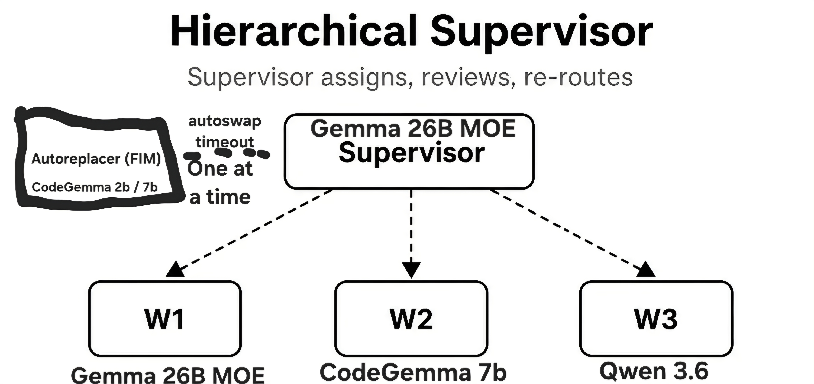

# SerenityDev README

This is the README for my extension "SerenityDev".
This is a vibe-coded extension/server made for VS Code and Android Studio (TBD), so I can run llm agents locally. 
the folder "serenitydev-0.0.1" is the original folder. models would go here for registration.
for model details, see serenitydevserver.py and ctrl-f "gguf"

## Features

Ollama model registry
llama.cpp inference with Ollama fallback
hyper-specific model routing (registration of alternate models to be added)

### Supervisor vs Workers

the supervisor routes to a system pictured below. To skip all this, select a worker (W1-4)
(Note: not pictured is W4, Qwen3.6-27B.)

This is simply an extension for Local Agentic purposes, because I'm picky and don't like any available options.
its not meant to work for many purposes, yet.

> Tip: Many popular extensions utilize animations. This is an excellent way to show off your extension! We recommend short, focused animations that are easy to follow.

## Requirements

see imports.

## Extension Settings

This extension contributes the following settings:

* `Serenity:extension status control panel`: Resume, Pause, Stop this extension.

## Known Issues

Probably a lot.
Models reason in chat, not seperated.
I'm still not sure if it all works correctly.

## Release Notes

migrated standalone server folder into VS extension.

### 1.0.0

Initial release

## Feedback and Improvements

Do what you want... I'm not an expert by any means.

